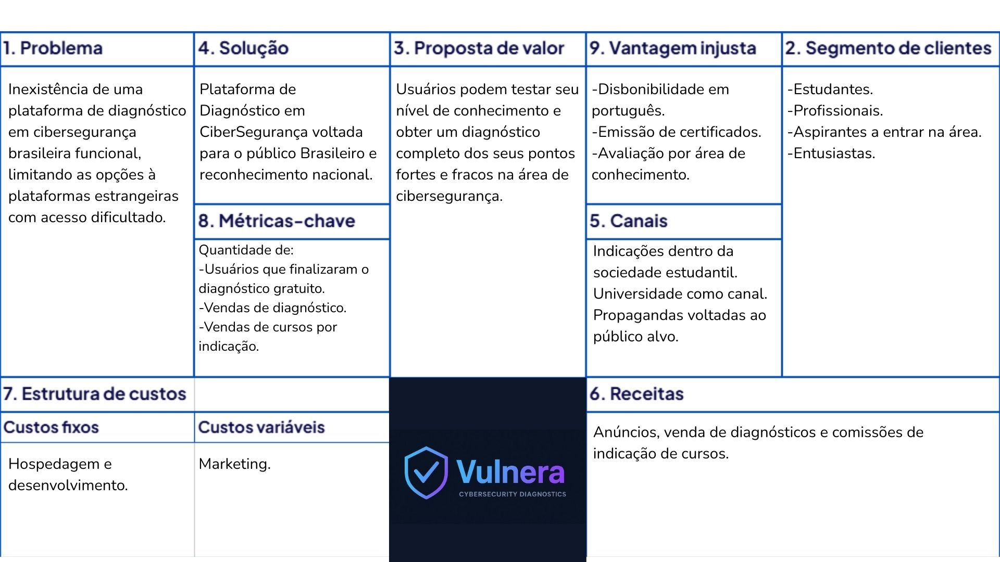

# 📌 Vulnera - Plataforma de Diagnóstico em Cybersegurança

Problema identificado:
A crescente demanda por profissionais de cibersegurança contrasta com a falta de ferramentas acessíveis para avaliar o nível de conhecimento de estudantes, iniciantes e até mesmo de colaboradores em empresas. Muitas vezes não há um diagnóstico inicial que indique lacunas de aprendizado, dificultando a escolha de treinamentos adequados e a formação de profissionais mais preparados.

Solução proposta:
A Plataforma de Avaliação em Cibersegurança oferece testes diagnósticos gratuitos para medir conhecimentos básicos e módulos avançados pagos para aprofundar a avaliação. O sistema gera pontuação, ranking e relatórios que destacam pontos fortes e fracos de cada usuário. Além disso, possibilita parcerias com cursos e treinamentos, criando uma trilha de aprendizado personalizada que conecta a avaliação inicial com a capacitação necessária.

---

## 👥 Integrantes

- Caio Henrique Carvalho de Paiva – RA: 1433335  
- Luiz Felipe Loro Piva – RA: 1439917 
- Henrique Luiz Lopes – RA: 1439763
- Flávio de Carvalho Cury - RA: 1438842

---

## 🧭 Etapas do Projeto

### 1️⃣ Definição do Problema e da Solução
- **Problema identificado:** Inexistência de uma plataforma de diagnóstico em cibersegurança brasileira funcional,
limitando as opções à plataformas estrangeiras com acesso dificultado.
- **Público-alvo:** Estudantes, Profissionais, Aspirantes a entrar na área e entusiastas.
- **Impacto esperado:** Conhecimentos mais concretos nacionalmente na área de cibersegurança.
- **Solução proposta:** Plataforma de Diagnóstico em CiberSegurança voltada para o público Brasileiro e reconhecimento nacional.

### 2️⃣ Lean Canvas / Missão, Visão e Valores

- Lean Canvas:


- Missão: Aprimorar os conhecimentos em CiberSegurança no Brasil
- Visão: Foco em identificar lacunas de conhecimento, Guiar os estudantes a conteúdos integros.
- Valores: Integridade, Qualidade, Confiabilidade, Impacto Nacional.

### 3️⃣ Custos e Tributos (Plano de Negócios - PNBOX)
- Custos fixos:  
- Custos variáveis:  
- Tributos aplicáveis:  

### 4️⃣ Investimentos e Precificação
- Investimento inicial:  
- Estratégia de precificação:  
- Justificativa:  

### 5️⃣ SWOT (Análise de Ambientes)
- Forças:  
- Fraquezas:  
- Oportunidades:  
- Ameaças:  

### 6️⃣ Planejamento Estratégico (BSC)
- Objetivos estratégicos:  
- Indicadores e metas:  
- Ações planejadas:  

### 7️⃣ Fluxo de Caixa
- Planilha ou print do fluxo projetado:  
- Principais considerações:  

### 8️⃣ Valuation
- Método utilizado:  
- Valor estimado:  

### 9️⃣ Segurança Cibernética
- Riscos identificados:  
- Medidas de segurança:  

---

## 📅 Diário de Bordo 🚧 ✅

| Data       | Conteúdo/Etapa                     | Status     | Observações |
|------------|------------------------------------|------------|-------------|
| 06/08/2025 | Apresentação Disciplina + Start    | ✅ Concluído | — |
| 13/08/2025 | Definição dos Grupos e Propostas   | ✅ Concluído | Ajustar proposta com feedback do professor |
| 20/08/2025 | Criação do Lean Canvas | ✅ Concluído | - |
 	 	 	

---

## 📦 Entregas

| Entrega                                | Data       | Descrição                                                         | Status |
|----------------------------------------|------------|-------------------------------------------------------------------|--------|
| Lean Canvas                            | 20/08/2025 | Documento e imagem do canvas                                      | Concluído |
| Custos e Tributos                      | 27/08/2025 | Planilha com custos fixos, variáveis e tributos                   | —      |
| Análise SWOT / Plano de Negócios       | 24/09/2025 | Análise de ambientes SWOT e entrega do Plano de Negócios          | —      |
| Fluxo de Caixa / Planejamento Estratégico | 15/10/2025 | Planilha de fluxo de caixa e entrega do Planejamento Estratégico  | —      |
| Valuation                              | 05/11/2025 | Relatório com cálculo de valuation                                | —      |
| Valuation      | 12/11/2025 | Valuation | —      |

---

## 🗣️ Feedbacks Recebidos

| Data       | De Quem     | Feedback                                                        | Ação Tomada |
|------------|-------------|----------------------------------------------------------------|-------------|
| 24/09/2025 | Professor X | Melhorar clareza da análise SWOT                                | Revisão feita |

---

## 📚 Lições Aprendidas
- O que a equipe aprendeu durante cada fase.  

---

## 📁 Organização do Repositório

```
 📦 projeto/
 ┣ 📂 docs/
 ┃ ┣ 📂 img/
 ┃ ┃ ┗ TAI3_Lean_Canva.jpg
 ┃ ┗ documento.md
 ┗ README.md
```

---
