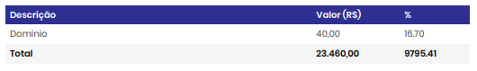

# 📌 Vulnera - Plataforma de Diagnóstico em Cybersegurança

Problema identificado:
A crescente demanda por profissionais de cibersegurança contrasta com a falta de ferramentas acessíveis para avaliar o nível de conhecimento de estudantes, iniciantes e até mesmo de colaboradores em empresas. Muitas vezes não há um diagnóstico inicial que indique lacunas de aprendizado, dificultando a escolha de treinamentos adequados e a formação de profissionais mais preparados.

Solução proposta:
A Plataforma de Avaliação em Cibersegurança oferece testes diagnósticos gratuitos para medir conhecimentos básicos e módulos avançados pagos para aprofundar a avaliação. O sistema gera pontuação, ranking e relatórios que destacam pontos fortes e fracos de cada usuário. Além disso, possibilita parcerias com cursos e treinamentos, criando uma trilha de aprendizado personalizada que conecta a avaliação inicial com a capacitação necessária.

---

## 👥 Integrantes

- Caio Henrique Carvalho de Paiva – RA: 1433335  
- Luiz Felipe Loro Piva – RA: 1439917 
- Henrique Luiz Lopes – RA: 1439763
- Flávio de Carvalho Cury - RA: 1438842

---

## 🧭 Etapas do Projeto

### 1️⃣ Definição do Problema e da Solução
- **Problema identificado:** Inexistência de uma plataforma de diagnóstico em cibersegurança brasileira funcional,
limitando as opções à plataformas estrangeiras com acesso dificultado.
- **Público-alvo:** Estudantes, Profissionais, Aspirantes a entrar na área e entusiastas.
- **Impacto esperado:** Conhecimentos mais concretos nacionalmente na área de cibersegurança.
- **Solução proposta:** Plataforma de Diagnóstico em CiberSegurança voltada para o público Brasileiro e reconhecimento nacional.

### 2️⃣ Lean Canvas / Missão, Visão e Valores

- Lean Canvas:


- Missão: Aprimorar os conhecimentos em CiberSegurança no Brasil
- Visão: Foco em identificar lacunas de conhecimento, Guiar os estudantes a conteúdos integros.
- Valores: Integridade, Qualidade, Confiabilidade, Impacto Nacional.

### 3️⃣ Custos e Tributos (Plano de Negócios - PNBOX)
[Custos de Estudo](docs/custos_estudo.md)

- Custos fixos:
- 

 
- Custos variáveis:
- 


- Custos Totais:
- 





### 4️⃣ Investimentos e Precificação
### Investimentos:
#### Fixo: 
##### Total: R$0,00
<hr/>

#### Pré-operacional 
- Certificado SSL - R$70,00
- Dominio - R$40,00
- Marketing - R$600,00
- Registro de Marca - R$440,00 (Valor médio para microempresas)
- Infraestrututra AWS - R$240,00
##### Total: R$1.140,00


<hr/>

#### Capital de Giro (MENSAL)
- Marketing - R$350,00
- Infraestrututra AWS - R$240,00
- Manutenção - R$0,00 (R$3.000,00 caso necessite funcionario)
- Impostos - até 20% (Imposto sobre o ganho)
##### Total: R$630,00 + impostos

Exemplificação com faturamento de 20mil/mês para demonstrar o impacto tributário:

- Marketing - R$350,00
- Infraestrututra AWS - R$240,00
- Manutenção - R$0,00 (R$3.000,00 caso necessite funcionario)
  - Impostos patronais - FGTS (8%); 13º salário (8,33%); Férias + 1/3 (11,11%); Aviso prévio e extras (2%).
  - Total 29,44% ~= 29,5% (R$885,00)
- Impostos - R$1200,00  6% do faturamento (Imposto sobre o ganho)
  
Faturamento bruto: R$20.000,00

Faturamento liquído (Sem funcionário): R$18.210,00

Faturamento liquído (Com funcionário): R$14.325,00


<hr/>

### Precificação:
#### Valor entregue:
Usuário consegue determinar as brechas no seu conhecimento sobre cibersegurança, direcionando o foco dos estudos, economizando tempo de planejamento e concretizando o conhecimento com certificados.


#### Capacidade de pagamento:
Estimativa entre R$30,00 para planos mais básicos até R$200,00 para pacotes completos.


#### Concorrência:
- Hackers do bem - Não há cobrança, porém é considerado limitado em suas funcionalidades.
- Guardey - Focado mais em treinamentos, faz diagnósticos porém não possui conteúdo em português do Brasil
- Phished - Também focado em treinamento, porém conteúdo em inglês

#### Modelo de Precificação:
Diferenciação por funcionalidades.


#### Peridicidade:
Não há.
<hr/>

### Métricas
#### CAC:
Marketing /N de clientes novos conquistados

Estimatíva: 350,00/10 = R$35,00


#### ARPU:
Receita média por usuário

Estimatíva: R$40,00


#### LTV:
Ticket Médio x Frequência de Compra x Tempo de Vida do Cliente

Estimatíva: 40,00 x 3 x 3 = R$360,00 

### Plano de Negócio:
[Plano de Negócio](docs/plano_de_negocio.md)

### 5️⃣ SWOT (Análise de Ambientes)
[Plano de Negócio](docs/plano_de_negocio.md)

### 6️⃣ Planejamento Estratégico (BSC)
Perspectiva Financeira pré operacional Vulnera:

- Objetivos:
  
 Estabelecer fluxo de caixa positivo até o 18º mês de operação;
 Alcançar ponto de equilíbrio (break-even) em 6 meses;
 Manter controle rigoroso de custos e despesas iniciais;
 Atingir receita mensal projetada de R$1800 até o final do primeiro ano.

- Indicadores:
  
 Faturamento projetado: R$10.000 no 1º ano, com crescimento de 20% ao ano;
 Despesas operacionais planejadas: até 80% do faturamento;
 Lucro líquido estimado: R$2.000 até o final do 12º ciclo;
 Margem de lucratividade esperada: 20%;
 Ponto de equilíbrio: R$ 800,00 - 900,00 em receita mensal.

Perspectiva dos Clientes:

- Objetivos:
  
 Aumentar a confiabilidade do cliente;
 Oferecer avaliações acessíveis e de qualidade;
 Aumentar a confiança do usuário em suas habilidades;
 Ampliar o acesso à educação em cibersegurança;
 Alcançar reconhecimento como referência em testes de cibersegurança.

- Indicadores:
  
 Número de usuários ativos e recorrentes;
 Taxa de recompra dos testes;
 Taxa de usuários convertidos em clientes;
 Nível de satisfação dos usuários;
 Crescimento da base de assinantes;
 Número de clientes que compraram cursos parceiros.

Perspectiva dos Processos Internos:

- Objetivos:
  
 Desenvolver processos internos eficientes.
 Definir métodos de trabalho padronizados.
 Garantir que as atividades sejam realizadas com agilidade e qualidade. 
 Reduzir possíveis falhas durante o desenvolvimento. 
 Criar uma base sólida para a futura operação e atendimento aos clientes.

- Indicadores:
  
 Tempo médio de execução das atividades.
 Número de revisões ou retrabalhos necessários até a entrega final.
 Frequência de reuniões de acompanhamento de processos.
 Cumprimento dos prazos estabelecidos nas etapas do projeto.

Perspectiva do Aprendizado e Crescimento:

- Objetivos:
  
 Como a empresa é composta apenas pelos quatro sócios e ainda está em fase inicial, o foco está no desenvolvimento técnico e organizacional do grupo;
 busca-se aprimorar conhecimentos nas áreas essenciais do negócio;
 consolidar uma cultura baseada em inovação e cooperação;
 e melhorar gradualmente os equipamentos e ferramentas utilizadas.

- Indicadores:
  
 Como indicadores, serão considerados as horas de capacitação de cada sócio;
 O investimento em infraestrutura e equipamentos;
 A realização de reuniões periódicas de alinhamento;
 E a criação de registros internos que contribuam para a organização e o crescimento da empresa.

### 7️⃣ Fluxo de Caixa
- Planilha ou print do fluxo projetado:  
- Principais considerações:  

### 8️⃣ Valuation
- Método utilizado:  
- Valor estimado:  

### 9️⃣ Segurança Cibernética
- Riscos identificados:  
- Medidas de segurança:  

---

## 📅 Diário de Bordo 🚧 ✅

| Data       | Conteúdo/Etapa                     | Status     | Observações |
|------------|------------------------------------|------------|-------------|
| 06/08/2025 | Apresentação Disciplina + Start    | ✅ Concluído | - |
| 13/08/2025 | Definição dos Grupos e Propostas   | ✅ Concluído | Ajustar proposta com feedback do professor |
| 20/08/2025 | Criação do Lean Canvas | ✅ Concluído | - |
| 10/09/2025 | Criação da planilha de Custos e Tributos | ✅ Concluído | - |
| 17/09/2025 | Criação do plano de Negócios | ✅ Concluido | - |
 	 	 	

---

## 📦 Entregas

| Entrega                                | Data       | Descrição                                                         | Status |
|----------------------------------------|------------|-------------------------------------------------------------------|--------|
| Lean Canvas                            | 26/08/2025 | Documento e imagem do canvas                                      | Concluído |
| Custos e Tributos                      | 10/09/2025 | Planilha com custos fixos, variáveis e tributos                   | Concluído |
| Plano de Negócios                      | 17/09/2025 | levantamento completo dos investimentos e precificações           | Concluido |
| Análise SWOT                           | 24/09/2025 | Análise de ambientes SWOT                                         | Concluido |
| Fluxo de Caixa / Planejamento Estratégico | 15/10/2025 | Planilha de fluxo de caixa e entrega do Planejamento Estratégico  | —      |
| Valuation                              | 05/11/2025 | Relatório com cálculo de valuation                                | —      |
| Valuation      | 12/11/2025 | Valuation | —      |

---

## 🗣️ Feedbacks Recebidos

| Data       | De Quem     | Feedback                                                        | Ação Tomada |
|------------|-------------|----------------------------------------------------------------|-------------|
| 24/09/2025 | Professor X | Melhorar clareza da análise SWOT                                | Revisão feita |

---

## 📚 Lições Aprendidas
- O que a equipe aprendeu durante cada fase.  

---

## 📁 Organização do Repositório

```
 📦 projeto/
 ┣ 📂 docs/
 ┃ ┣ 📂 img/
 ┃ ┃ ┗ TAI3_Lean_Canva.jpg
 ┃ ┗ documento.md
 ┗ README.md
```

---
