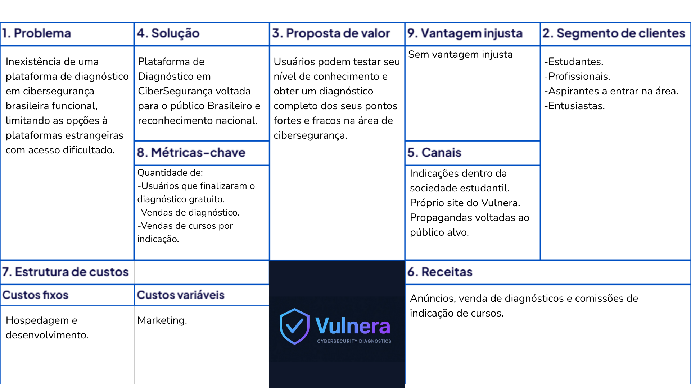
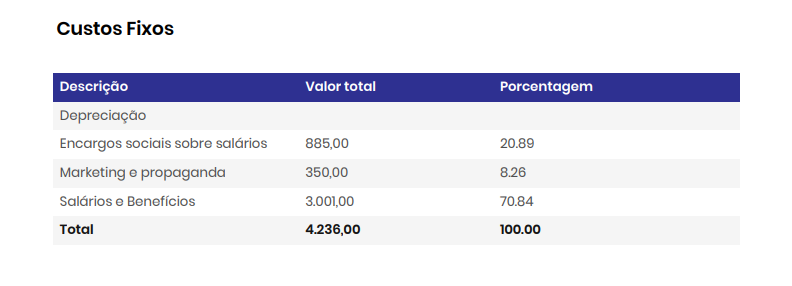
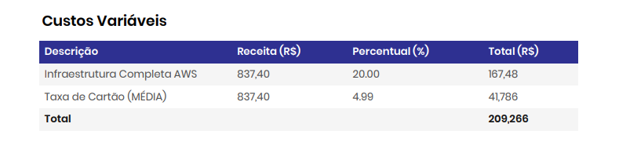
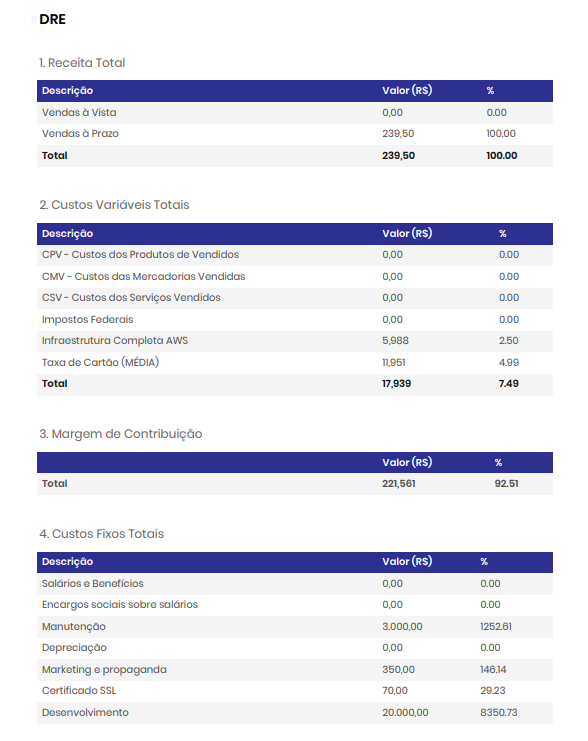
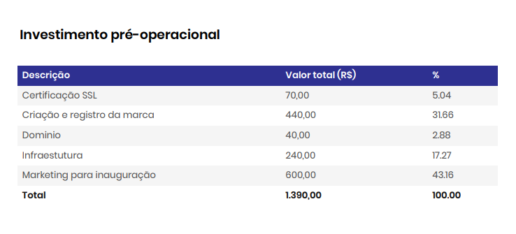
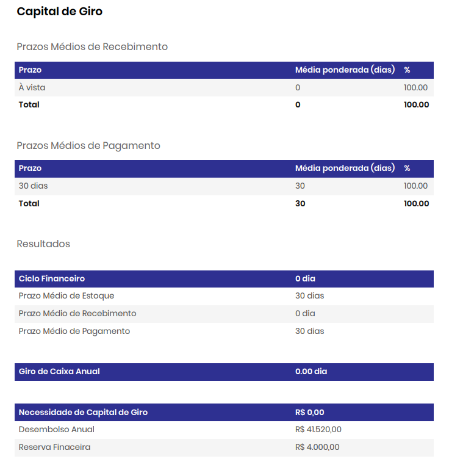
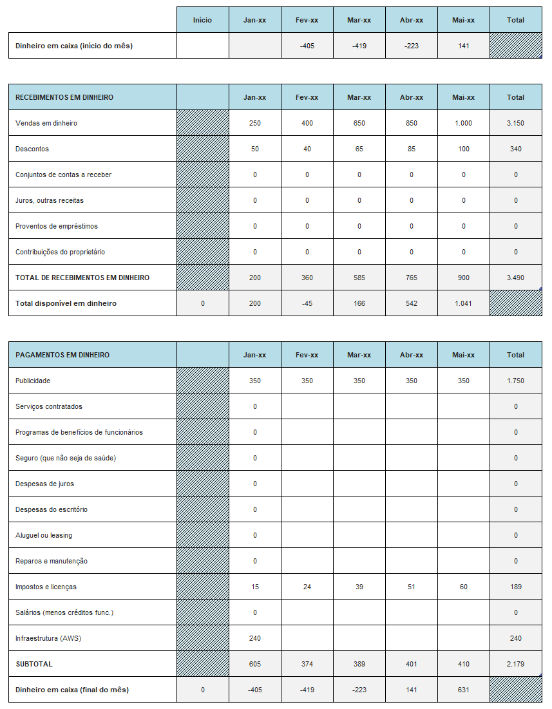

# 📌 Vulnera - Plataforma de Diagnóstico em Cybersegurança

Problema identificado:
A crescente demanda por profissionais de cibersegurança contrasta com a falta de ferramentas acessíveis para avaliar o nível de conhecimento de estudantes, iniciantes e até mesmo de colaboradores em empresas. Muitas vezes não há um diagnóstico inicial que indique lacunas de aprendizado, dificultando a escolha de treinamentos adequados e a formação de profissionais mais preparados.

Solução proposta:
A Plataforma de Avaliação em Cibersegurança oferece testes diagnósticos gratuitos para medir conhecimentos básicos e módulos avançados pagos para aprofundar a avaliação. O sistema gera pontuação, ranking e relatórios que destacam pontos fortes e fracos de cada usuário. Além disso, possibilita parcerias com cursos e treinamentos, criando uma trilha de aprendizado personalizada que conecta a avaliação inicial com a capacitação necessária.

---

## 👥 Integrantes

- Caio Henrique Carvalho de Paiva – RA: 1433335  
- Luiz Felipe Loro Piva – RA: 1439917 
- Henrique Luiz Lopes – RA: 1439763
- Flávio de Carvalho Cury - RA: 1438842

---

## 🧭 Etapas do Projeto

### 1️⃣ Definição do Problema e da Solução
- **Problema identificado:** Inexistência de uma plataforma de diagnóstico em cibersegurança brasileira funcional,
limitando as opções à plataformas estrangeiras com acesso dificultado.
- **Público-alvo:** Estudantes, Profissionais, Aspirantes a entrar na área e entusiastas.
- **Impacto esperado:** Conhecimentos mais concretos nacionalmente na área de cibersegurança.
- **Solução proposta:** Plataforma de Diagnóstico em CiberSegurança voltada para o público Brasileiro e reconhecimento nacional.

### 2️⃣ Lean Canvas / Missão, Visão e Valores

- Lean Canvas:


- Missão: Aprimorar os conhecimentos em CiberSegurança no Brasil
- Visão: Foco em identificar lacunas de conhecimento, Guiar os estudantes a conteúdos integros.
- Valores: Integridade, Qualidade, Confiabilidade, Impacto Nacional.

### 3️⃣ Custos e Tributos (Plano de Negócios - PNBOX)
[Custos de Estudo](docs/custos_estudo.md)

- Custos fixos:
- 

 
- Custos variáveis:
- 


- Custos Totais:
- 



### 4️⃣ Investimentos e Precificação
### Investimentos:
#### Fixo: 
##### Total: R$0,00
<hr/>

#### Pré-operacional 
- Certificado SSL - R$70,00
- Dominio - R$40,00
- Marketing - R$600,00
- Registro de Marca - R$440,00 (Valor médio para microempresas)
- Infraestrututra AWS - R$240,00
##### Total: R$1.140,00


<hr/>

#### Capital de Giro (MENSAL)
- Marketing - R$350,00
- Infraestrututra AWS - R$240,00
- Manutenção - R$0,00 (R$3.000,00 caso necessite funcionario)
- Impostos - até 20% (Imposto sobre o ganho)
##### Total: R$590,00 + impostos

## Simulação com Faturamento de R$20.000/mês

## Sem Funcionário

Marketing: R$350,00

Infraestrutura AWS: R$240,00

Manutenção: R$0,00

Impostos: R$1.200,00 (6% do faturamento bruto)
→ Total de custos: R$1.790,00
→ Faturamento líquido: R$18.210,00

## Com Funcionário

Marketing: R$350,00

Infraestrutura AWS: R$240,00

Manutenção: R$3.000,00

Encargos patronais (FGTS, 13º, férias, extras): 29,44% ≈ R$885,00

Impostos: R$1.200,00 (6% do faturamento bruto)
→ Total de custos: R$5.675,00
→ Faturamento líquido: R$14.325,00

## Capital de giro projetado para 9 meses:
| Despesa                          | Valor Mensal (R$) |  9 Meses (R$) | Observações                               |
| -------------------------------- | ----------------: | ------------: | ----------------------------------------- |
| **Marketing**                    |            350,00 |      3.150,00 | Campanhas em redes sociais e tráfego pago |
| **Infraestrutura AWS**           |            240,00 |      2.160,00 | Hospedagem e banco de dados               |
| **Manutenção (sem funcionário)** |              0,00 |          0,00 | Apenas monitoramento interno              |
| **Manutenção (com funcionário)** |          3.000,00 |     27.000,00 | Caso seja contratado suporte técnico      |
| **Impostos (estimado 6%)**       |          variável |      variável | Incide sobre o lucro mensal               |
| **Total (sem funcionário)**      |    **590,00/mês** |  **5.310,00** | Custo operacional mínimo                  |
| **Total (com funcionário)**      |  **3.590,00/mês** | **32.310,00** | Custo operacional ampliado                |

<hr/>

### Precificação:
#### Valor entregue:
Usuário consegue determinar as brechas no seu conhecimento sobre cibersegurança, direcionando o foco dos estudos, economizando tempo de planejamento e concretizando o conhecimento com certificados.

#### Capacidade de pagamento:

- Teste Diagnóstico Geral Básico – R$ 14,90

Voltado para iniciantes, este teste avalia os conceitos fundamentais de cibersegurança e boas práticas digitais. Ele permite ao usuário ter uma visão inicial sobre o quanto domina áreas essenciais como senhas seguras, phishing, engenharia social e segurança de dispositivos pessoais.
Entrega: relatório simples com pontuação geral, feedback por tema e recomendações iniciais de estudo.

- Teste Diagnóstico Geral Médio – R$ 24,90

Destinado a usuários que já possuem alguma familiaridade com segurança da informação. O teste aprofunda-se em tópicos como criptografia básica, autenticação multifator, redes seguras e análise de riscos pessoais.
Entrega: relatório intermediário com percentuais de acerto por categoria, nível de maturidade em segurança digital e lista de conteúdos sugeridos para avanço de nível.

- Teste Diagnóstico Geral Avançado – R$ 34,90

Indicados para usuários ou profissionais que desejam testar conhecimentos técnicos e estratégicos em cibersegurança. Inclui questões sobre vulnerabilidades comuns, pentest, segurança de rede, padrões ISO e resposta a incidentes, etc.
Entrega: relatório técnico completo e detelhado com análise de desempenho e certificado de proficiência emitido conforme o nível alcançado.

- Testes Diagnósticos Específicos (Sub-áreas) – R$ 34,90 (cada)

Focado em áreas específicas da cibersegurança, como Red Team, Blue Team, Forense Digital, Segurança em Redes, Criptografia ou Engenharia Social. Ideal para quem deseja medir domínio em um campo de atuação específico.
Entrega: relatório individual da subárea escolhida com pontuação detalhada, comparativo com o desempenho médio da comunidade e trilha de aprendizado personalizada para aprimoramento técnico naquela área.

- Pacote de Diagnósticos Específicos (5 Sub-áreas) – R$ 129,90

Oferece acesso a cinco testes de subáreas diferentes (a escolha), permitindo uma avaliação completa do perfil técnico do usuário.
Entrega: acesso aos cinco testes individuais, relatório consolidado com mapa de habilidades em cibersegurança, identificação de pontos fortes e fracos por domínio e certificado de competências gerais, ideal para incluir em portfólios e processos seletivos.

### Projeção de Receita por Cenários (Ticket médio R$ 50,00):
| Cenário   | Usuários Ativos | Ticket Médio (R$) | Receita Mensal (R$) | Receita em 9 Meses (R$) |     Lucro Estimado (sem impostos) |
| --------- | --------------: | ----------------: | ------------------: | ----------------------: | --------------------------------: |
| **Baixo** |              20 |                50 |            1.000,00 |               12.000,00 |  12.000 - 5.310 = **R$ 6.690,00** |
| **Médio** |              50 |                50 |            2.500,00 |               30.000,00 | 30.000 - 5.310 = **R$ 24.690,00** |
| **Alto**  |             100 |                50 |            5.000,00 |               60.000,00 | 60.000 - 5.310 = **R$ 54.690,00** |

#### Concorrência:
- Hackers do bem - Não há cobrança, porém é considerado limitado em suas funcionalidades.
- Guardey - Focado mais em treinamentos, faz diagnósticos porém não possui conteúdo em português do Brasil
- Phished - Também focado em treinamento, porém conteúdo em inglês

#### Modelo de Precificação:
Diferenciação por funcionalidades.


#### Peridicidade:
Não há.
<hr/>

### Métricas

| Métrica                                 | Fórmula                                   | Estimativa Atual           | Observação                                  |
| --------------------------------------- | ----------------------------------------- | -------------------------- | ------------------------------------------- |
| **CAC (Custo de Aquisição de Cliente)** | Marketing / Nº de clientes novos          | 350 / 10 = **R$ 35,00**    | Valor adequado para início                  |
| **ARPU (Receita Média por Usuário)**    | Receita total / Nº de usuários            | ≈ **R$ 40,00**             | Recalcular conforme novos pacotes           |
| **Churn (Taxa de cancelamento)**        | Clientes cancelados / Clientes ativos     | Estimado: 20%              | Base para calcular tempo de permanência     |
| **Tempo médio de permanência**          | 1 / churn                                 | 5 meses                    | Mantém coerência com o modelo de assinatura |
| **LTV (Lifetime Value)**                | Ticket médio × Frequência × Tempo de vida | 40 × 3 × 5 = **R$ 600,00** | Corrigido com base no churn real            |

### Plano de Negócio:
[Plano de Negócio](docs/plano_de_negocio.md)

### 5️⃣ SWOT (Análise de Ambientes)
[Plano de Negócio](docs/plano_de_negocio.md)

### 6️⃣ Planejamento Estratégico (BSC)
Perspectiva Financeira pré operacional Vulnera:

- Objetivos:
  
 Estabelecer fluxo de caixa positivo até o 18º mês de operação;
 Alcançar ponto de equilíbrio (break-even) em 6 meses;
 Manter controle rigoroso de custos e despesas iniciais;
 Atingir receita mensal projetada de R$1800 até o final do primeiro ano.

- Indicadores:
  
 Faturamento projetado: R$10.000 no 1º ano, com crescimento de 20% ao ano;
 Despesas operacionais planejadas: até 80% do faturamento;
 Lucro líquido estimado: R$2.000 até o final do 12º ciclo;
 Margem de lucratividade esperada: 20%;
 Ponto de equilíbrio: R$ 800,00 - 900,00 em receita mensal.

Perspectiva dos Clientes:

- Objetivos:
  
 Aumentar a confiabilidade do cliente;
 Oferecer avaliações acessíveis e de qualidade;
 Aumentar a confiança do usuário em suas habilidades;
 Ampliar o acesso à educação em cibersegurança;
 Alcançar reconhecimento como referência em testes de cibersegurança.

- Indicadores:
  
 Número de usuários ativos e recorrentes;
 Taxa de recompra dos testes;
 Taxa de usuários convertidos em clientes;
 Nível de satisfação dos usuários;
 Crescimento da base de assinantes;
 Número de clientes que compraram cursos parceiros.

Perspectiva dos Processos Internos:

- Objetivos:
  
 Desenvolver processos internos eficientes.
 Definir métodos de trabalho padronizados.
 Garantir que as atividades sejam realizadas com agilidade e qualidade. 
 Reduzir possíveis falhas durante o desenvolvimento. 
 Criar uma base sólida para a futura operação e atendimento aos clientes.

- Indicadores:
  
 Tempo médio de execução das atividades.
 Número de revisões ou retrabalhos necessários até a entrega final.
 Frequência de reuniões de acompanhamento de processos.
 Cumprimento dos prazos estabelecidos nas etapas do projeto.

Perspectiva do Aprendizado e Crescimento:

- Objetivos:
  
 Como a empresa é composta apenas pelos quatro sócios e ainda está em fase inicial, o foco está no desenvolvimento técnico e organizacional do grupo;
 busca-se aprimorar conhecimentos nas áreas essenciais do negócio;
 consolidar uma cultura baseada em inovação e cooperação;
 e melhorar gradualmente os equipamentos e ferramentas utilizadas.

- Indicadores:
  
 Como indicadores, serão considerados as horas de capacitação de cada sócio;
 O investimento em infraestrutura e equipamentos;
 A realização de reuniões periódicas de alinhamento;
 E a criação de registros internos que contribuam para a organização e o crescimento da empresa.

### 7️⃣ Fluxo de Caixa



### 8️⃣ Valuation
[Slides](docs/valuation_Vulnera.pdf)

### 9️⃣ Segurança Cibernética
- Riscos identificados:  
- Medidas de segurança:  

---

## 📅 Diário de Bordo 🚧 ✅

| Data       | Conteúdo/Etapa                     | Status     | Observações |
|------------|------------------------------------|------------|-------------|
| 06/08/2025 | Apresentação Disciplina + Start    | ✅ Concluído | - |
| 13/08/2025 | Definição dos Grupos e Propostas   | ✅ Concluído | Ajustar proposta com feedback do professor |
| 20/08/2025 | Criação do Lean Canvas | ✅ Concluído | - |
| 10/09/2025 | Criação da planilha de Custos e Tributos | ✅ Concluído | - |
| 17/09/2025 | Criação do plano de Negócios | ✅ Concluido | - |
 	 	 	

---

## 📦 Entregas

| Entrega                                | Data       | Descrição                                                         | Status |
|----------------------------------------|------------|-------------------------------------------------------------------|--------|
| Lean Canvas                            | 26/08/2025 | Documento e imagem do canvas                                      | Concluído |
| Custos e Tributos                      | 10/09/2025 | Planilha com custos fixos, variáveis e tributos                   | Concluído |
| Plano de Negócios                      | 17/09/2025 | levantamento completo dos investimentos e precificações           | Concluido |
| Análise SWOT                           | 24/09/2025 | Análise de ambientes SWOT                                         | Concluido |
| Fluxo de Caixa / Planejamento Estratégico | 15/10/2025 | Planilha de fluxo de caixa e entrega do Planejamento Estratégico  | Concluido |
| Valuation                              | 05/11/2025 | Relatório com cálculo de valuation                                | Concluido |
| Valuation      | 12/11/2025 | Valuation | Concluido |

---

## 🗣️ Feedbacks Recebidos

| Data       | De Quem     | Feedback                                                        | Ação Tomada |
|------------|-------------|----------------------------------------------------------------|-------------|
| 24/09/2025 | Professor X | Melhorar clareza da análise SWOT                                | Revisão feita |

---

## 📚 Lições Aprendidas
- O que a equipe aprendeu durante cada fase.  

---

## 📁 Organização do Repositório

```
 📦 projeto/
 ┣ 📂 docs/
 ┃ ┣ 📂 img/
 ┃ ┃ ┗ TAI3_Lean_Canva.jpg
 ┃ ┗ documento.md
 ┗ README.md
```

---
