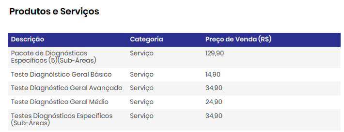
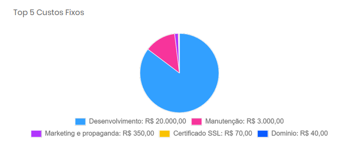

### Estudo de custos:

- Desenvolvimento - 20.000 - Fixo Indireto

- AWS - 50,00/mês - Variavel Direto (Infra Completa Sob Demanda)

- Marketing - 350,00/mês - Fixo indireto

- Taxa de Cartões/Pix - 1,99% a 7,99% - Fixo Direto

- Manutenção - 3.000/mês - Despesa

- Certificado SSL - 40 a 100 por ano - Fixo Indireto

- Domínio - 40,00/ano - Fixo Indireto

