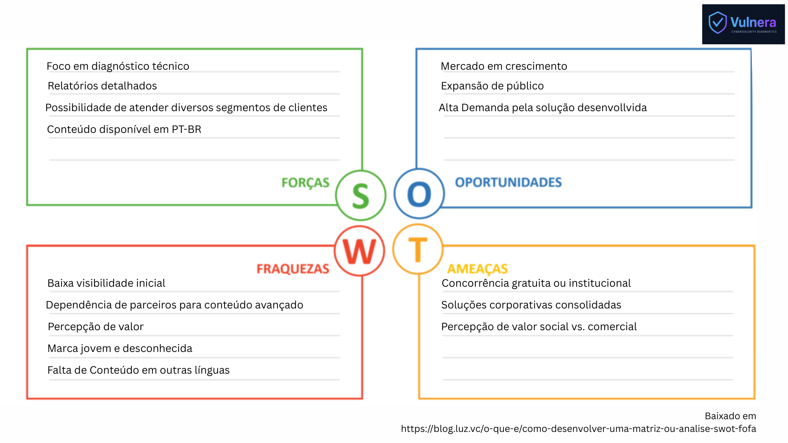

# Plano de negócios

Natureza Jurídica: Sociedade Limitada (LTDA)
Motivos: Protege o patrimônio pessoal dos fundadores, Permite entrada de sócios ou investidores no futuro, Estrutura compatível
com empresas de tecnologia que buscam crescimento escalável e Flexibilidade na gestão e adequação ao Simples Nacional.

Regime tributário: Simples Nacional 
Motivos: O Vulnera opta pelo Simples Nacional por combinar simplicidade e eficiência tributária, já que consolida diversos
impostos, como IRPJ, CSLL, PIS, COFINS e ISS, em uma única guia de pagamento (DAS), reduzindo burocracia e facilitando o controle
financeiro. Além disso, oferece uma carga tributária inicial relativamente baixa, permitindo que mais recursos sejam investidos no
crescimento do negócio, e é compatível com o porte da empresa, enquadrando-se perfeitamente no limite de faturamento anual de micro
e pequenas empresas. O regime proporciona previsibilidade para o planejamento financeiro e operacional, facilita a gestão contábil
ao exigir menos obrigações acessórias complexas e mantém flexibilidade para migração futura a regimes como Lucro Presumido ou Lucro Real,
garantindo adaptabilidade sem prejudicar o início da operação.

Tributação incidente:
IRPJ (0,57% – 1,25%);
CSLL(0,38% – 0,83%);
PIS(0,11% – 0,25%);
COFINS(0,52% – 1,20%);
ISS(2% - 5%).
Total inicial aproximado 6% - 15,5%.
Alíquota aumenta conforme receita

Obrigações acessórias:

Mensais:
As obrigações acessórias mensais da empresa incluem a emissão de notas fiscais referentes a todos os serviços prestados, o preenchimento e envio do PGDAS-D, que é a declaração utilizada para informar o faturamento e calcular os tributos do Simples Nacional, e o pagamento da guia DAS, que consolida impostos como IRPJ, CSLL, PIS, COFINS e ISS em um único documento. Além disso, é necessário manter o Livro Caixa Simplificado atualizado, registrando todas as entradas e saídas financeiras da empresa, e realizar backups e armazenamento das notas fiscais eletrônicas, garantindo a integridade e disponibilidade desses documentos para fins de auditoria e controle contábil.

Anuais:
Já as obrigações acessórias anuais envolvem a consolidação do Livro Caixa Simplificado, reunindo todas as movimentações financeiras do ano, e a entrega da DEFIS (Declaração de Informações Socioeconômicas e Fiscais), que substitui a ECF para empresas optantes pelo Simples Nacional. Também é importante realizar o encerramento contábil e a elaboração do balanço anual, permitindo avaliar o desempenho financeiro e cumprir exigências legais, além da renovação das certidões negativas de débitos municipais, estaduais e federais, assegurando que a empresa mantenha sua regularidade fiscal perante os órgãos competentes.

# Pesquisa de mercado

### Hackers do bem

O Hackers do Bem representa uma ameaça significativa à Vulnera por seu forte apelo social e educacional, oferecendo capacitação gratuita em cibersegurança e alcançando o mesmo público-alvo iniciante que a plataforma da Vulnera busca atrair. Seu modelo gratuito reduz a barreira de entrada e cria uma expectativa de acesso livre, o que pode dificultar a conversão de usuários em clientes pagantes para a Vulnera.

Além disso, o Hackers do Bem possui apoio do governo e de grandes instituições, o que reforça sua credibilidade e torna mais difícil para a Vulnera competir em editais, parcerias e programas de capacitação pública. A formação de uma comunidade nacional de profissionais certificados também consolida o projeto como uma referência no setor, diminuindo o espaço de destaque da Vulnera.

Por fim, a ampla exposição midiática e o caráter social do Hackers do Bem fortalecem sua imagem institucional, enquanto a Vulnera pode ser percebida como uma iniciativa comercial. Essa diferença de percepção pode limitar o alcance da Vulnera junto a órgãos públicos e projetos de impacto social, reduzindo sua visibilidade e poder de atração no mercado.

### Guardey

O Guardey representa uma ameaça mais indireta à Vulnera, mas ainda relevante. Por ser voltado para empresas, o Guardey oferece avaliações contínuas de segurança e treinamentos voltados ao comportamento seguro dos colaboradores, o que pode atrair parte do público corporativo que a Vulnera pretende atingir. Essa abordagem prática e focada em conscientização empresarial pode reduzir o interesse das empresas em adotar uma plataforma de avaliação técnica mais voltada a indivíduos, como a Vulnera.

Além disso, o Guardey já atua com uma proposta consolidada de “cyber awareness gamificada”, oferecendo relatórios e métricas de engajamento para gestores, o que reforça seu valor em ambientes corporativos. Essa maturidade no segmento empresarial pode dificultar a entrada da Vulnera nesse nicho, especialmente se ela planejar expandir seus serviços para equipes e organizações.

Por outro lado, como o Guardey é mais voltado à cultura de segurança dentro das empresas, e não à avaliação técnica de conhecimentos, ele não concorre diretamente com a Vulnera em todos os aspectos. Ainda assim, sua presença no mercado empresarial pode limitar futuras parcerias ou oportunidades da Vulnera com companhias que já adotem o Guardey como solução principal.

### Phished

O Phished representa uma ameaça indireta à Vulnera, já que foca em treinamentos de phishing e conscientização corporativa. Embora não ofereça testes diagnósticos de cibersegurança como a Vulnera, ele atua no mesmo ecossistema de capacitação e pode ocupar a atenção de empresas e profissionais interessados em segurança, reduzindo o interesse inicial por avaliações técnicas mais amplas. Além disso, sua presença consolidada no mercado de conscientização corporativa fortalece sua marca e cria barreiras de entrada para soluções complementares voltadas a diagnósticos, como a Vulnera.

# SWOT

